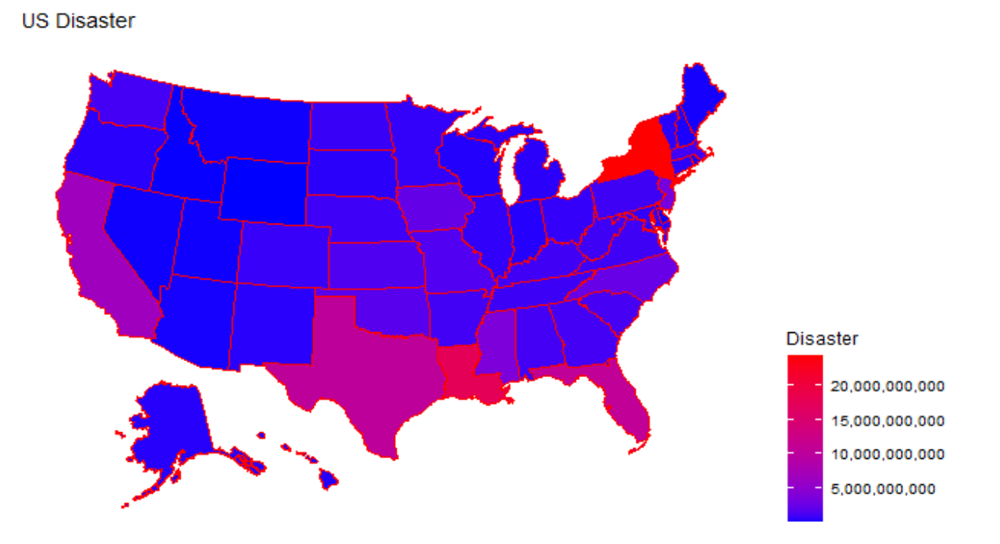
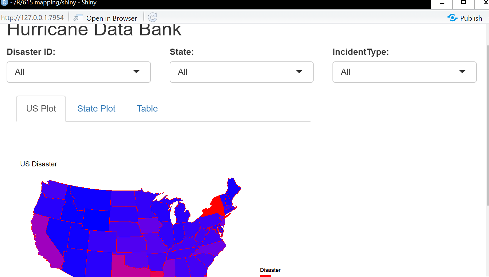

```{r setup, include=FALSE}

suppressPackageStartupMessages(
  library(tidyverse))

  library(scales)
  library(methods)
  library(knitr)
  library(kableExtra)

  library(janeaustenr)
  library(dplyr)
  library(stringr)

  library(tidytext)
  library(gutenbergr)

  library(scales)
  library(usmap)
  

  opts_chunk$set(
  comment = "#>",
  collapse = TRUE,
  cache = TRUE,
  warning = FALSE,
  message = FALSE,
  dpi = 300,
  cache.lazy = FALSE,
  tidy = "styler",
  out.width = "90%",
  fig.align = "center",
  fig.width = 5,
  fig.height = 7
)

  options(crayon.enabled = FALSE)

  theme_set(theme_light())

```


# About Data

<h2>The data is about the disaster distribution in the United State.

<h2> For more detailed information of the data:https://www.fema.gov/openfema-data-page/public-assistance-funded-projects-details-v1


# Data Preparation

<h1> - Data input


<h1> - Data Cleaning and Variable Selection

## Data input


```{r}
r <- read_csv("C:/Users/LXD/Documents/R/615 mapping/presentation/r(1).csv")
head(r)
```


## Data Cleaning

<div style="font-size:10pt; font-weight: bold">

<h3> Variable Selection:
<h4>  disasterNumber:helps us identify which disaster we are                              looking.
<h4>  county,state:help us locate where these disaster happened.
<h4>  incident type:helps us know what kinds of disaster it was.
<h4>  state number code,county code:help us draw the map.

```{r}
data<-r%>%group_by(disasterNumber,county,state)%>%summarise(projectAmount=sum(projectAmount),countyCode=max(countyCode),stateNumberCode=max(stateNumberCode),incidentType=max(incidentType),.groups = 'drop')
data1<-data%>%group_by(county)%>%summarise(projectAmount=sum(projectAmount),countyCode=max(countyCode),stateNumberCode=max(stateNumberCode),incidentType=max(incidentType),state=max(state),.groups = 'drop')
head(data1)

```


# Visualization-Mapping

<h2> we use function "plot_usmap" to make a maps that shows the disaster distribution. 

<p>
</p>

<h2> From the maps above, the red areas represent relatively more disaster, and the blue areas represent relatively less disaster.

## Based on DisasterNumber - take #1264 disaster for example

<h3> Based on US Map

<div style="font-size:9pt; font-weight: bold">

```{r echo=FALSE,fig.height=3}
data2<-data[data$disasterNumber == 1264,]
plot_usmap(data = data2, values = "projectAmount", color = "red") + 
      scale_fill_continuous(
        low = "blue", high = "red", name = "Disaster", label = scales::comma
      ) + labs(title = "US Disaster") + theme(legend.position = "right")

```


## Based on DisasterNumber - take #1264 disaster for example

<h3> Based on State map

<div style="font-size:9pt; font-weight: bold">

```{r echo=FALSE,fig.height=3}
a<-data2$state
data2<-data2%>%filter(county != "Statewide")
    data2<-data2 %>% rowwise %>% mutate(fips = 1000*stateNumberCode+countyCode)
plot_usmap(regions = "county", data = data2, values = "projectAmount",include = a ,color = "red") + 
      scale_fill_continuous(
        low = "blue", high = "red", name = "Disaster", label = scales::comma
      ) + labs(title = "US Disaster") + theme(legend.position = "right")

```

## Based on State
<h3> Take PA as an example:

<div style="font-size:9pt; font-weight: bold">
```{r echo=FALSE,fig.height=3}
data3<-data1[data1$state == "Pennsylvania",]

#Based on the US MaP
data3_1<-data3%>%group_by(state)%>%summarise(projectAmount=sum(projectAmount),countyCode=max(countyCode),stateNumberCode=max(stateNumberCode),incidentType=max(incidentType),.groups = 'drop')
    
plot_usmap(data = data3_1, values = "projectAmount", color = "red") + 
      scale_fill_continuous(
        low = "blue", high = "red", name = "Disaster", label = scales::comma
      ) + labs(title = "US Disaster") + theme(legend.position = "right")
#Based on the state Map
a<-data3$state
data3_2<-data3%>%filter(county != "Statewide")
    data3_2<-data3_2 %>% rowwise %>% mutate(fips = 1000*stateNumberCode+countyCode)
plot_usmap(regions = "county", data = data3_2, values = "projectAmount",include = a ,color = "red") + 
      scale_fill_continuous(
        low = "blue", high = "red", name = "Disaster", label = scales::comma
      ) + labs(title = "US Disaster") + theme(legend.position = "right")
```

## Based on Incident Type

<h3>Take Biological as an example

```{r echo=FALSE,fig.height=3}
data4<-data1[data1$incidentType == "Biological",]

#Based on the US MaP
data4_1<-data4%>%group_by(state)%>%summarise(projectAmount=sum(projectAmount),countyCode=max(countyCode),stateNumberCode=max(stateNumberCode),incidentType=max(incidentType),.groups = 'drop')
plot_usmap(data = data4_1, values = "projectAmount", color = "red") + 
      scale_fill_continuous(
        low = "blue", high = "red", name = "Disaster", label = scales::comma
      ) + labs(title = "US Disaster") + theme(legend.position = "right")
#Based on the state Map
a<-data4$state
data4_2<-data4%>%filter(county != "Statewide")
    data4_2<-data4_2 %>% rowwise %>% mutate(fips = 1000*stateNumberCode+countyCode)
plot_usmap(regions = "county", data = data4_2, values = "projectAmount",include = a ,color = "red") + 
      scale_fill_continuous(
        low = "blue", high = "red", name = "Disaster", label = scales::comma
      ) + labs(title = "US Disaster") + theme(legend.position = "right")
```

# Interation-Shiny 

<h4> We design an interactive shiny app so that people can use the filters to view the detailed situation of disaster distribution.

<h4> people can choose disasterid,state or incident type in the US plot, county or even view in the table.

<p>
</p>

# Thank you！


